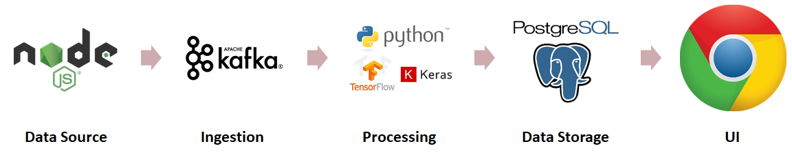

# Conversation Headline Analytics Tool (CHAT)

<div style="text-align:center; margin: 50px 0"></div>


Many live video broadcasting platforms (such as Twitch.TV, Youtube, etc.) often pairs their video content with chatrooms to allow for audience participation and interaction. This project focuses on Twitch TV, where there are on average [over 1 million viewers](https://twitchtracker.com/statistics/viewers) at any given point in time, and [over 45 thousand live channels](https://twitchtracker.com/statistics/channels) at a time.


In popular content (over 50k viewers), messages in stream chats could exceed 50 messages per second (in streams like Twitch Plays Pokemon), and these chatrooms are often heavily moderated by subscribers only chatting, message cooldowns, and other features to alleviate the high chat velocity. In order to enable content creators to appropriately interact with their audience (and audience members to interact with each other) while creating content, this tool ingests Twitch TV messages, saves message count and outputs one of four audience sentiments (Question, Disappointment, Funny, and Neutral) every five seconds for each channel to a PostgreSQL database, and this information is displayed through a chrome extension for content creators to observe superficial audience behavior and react accordingly.


This tool performs its task to over 100 channels a time by utilizing distributed technologies Kafka and PostgreSQL, and can be scaled horizontally by adding number of processing nodes.


# Architecutre

<div style="text-align:center; margin: 50px 0"></div>

This tool uses the following architecture:

1. **NodeJS Chatbot** - This tool uses a NodeJS chatbot installed on multiple nodes to ingest messages from Twitch.TV. The source of this code was taken from [Twitch.tv](https://dev.twitch.tv/docs/irc/), modified to be able to output messages to Kafka. Each Chatbot is measured to be able to produce 500 messages per second to Kafka.
2. **Kafka** - Kafka is a fault tolerant distributed technology that allows for messages to be produced and consumed by different nodes, utilizing brokers nodes in between with partitioning. Kafka allows the horizontal scalability of this tool; any number of nodes can be added to either the consumer or producer nodes.
3. **Python Keras** - The consumption (counting) of messages from Kafka is performed using Python, with sentiment analysis powered by Keras. The machine learning algirthm is trained using a [dataset of 1113 sentences](https://github.com/Dark-Sied/Intent_Classification), reclassified by me, with an addition of another >1000 messages recorded from Twitch TV's official channel. The current test accuracy of this model is 87%, but the data source is highly specific, and can be improven in the future. This script can process up to 8000 messages per second.  
4. **PostgreSQL** - The output of the python script is saved to PostgreSQL so that this information can be retrieved easily. This database has one relation, with the columns (in addition to a serial output ID) of channel name, date, time, number of messages, and number of messages of each of the four sentiments.
5. **Chrome Extension** - The Google Chrome Extension is written to be activated on Twitch.Tv domains, and will call a Flask powered Webapp that will plot the number of messages with respect to time, and label the sentiments.


## Getting Started

To gain a copy of this project and test this project:
`git clone https://github.com/laitcl/ChatroomAnalytics.git`

Fill in the credential documents with your own accounts. They are located in the following in the following
```
PostgresPass.txt
TwitchBot/credential.js
ChromeExtension/Flask/PostgresPass.txt
ChromeExtension/Flask/pusherinfo.txt
```

Point towards the correct servers of Kafka-Brokers

In consumer.py
```
consumer = KafkaConsumer(
    *topics,
     bootstrap_servers=[server1, server2],
     auto_offset_reset='earliest',
     enable_auto_commit=True,
     group_id='my-group')
```

In TwitchBot/chatbot_Lai.js
```
  var stream = Kafka.Producer.createWriteStream({
    'metadata.broker.list': hosts
  }, {}, {
    topic: target
  });
```

Point towards the correct PostGres Database:

In consumer.py
```
conn = psycopg2.connect(user="laitcl",
                             password=passwordstring,
                             host=hostname,
                             port="5432",
                             database="testpython")
```

In ChromeExtension/Flask/App.py
```
try:
    conn = psycopg2.connect(user = "laitcl",
                                 password = passwordstring,
                                 host = hostname,
                                 port = "5432",
                                 database = "testpython")
```

Point towards your own pusher account:

In ChromeExtension/Flask/App.py
```
with open ('pusherinfo.txt', 'r') as file:
    secretstring = file.readline().split("\n")[0]
    pusher = Pusher(
        app_id='811964',
        key='114fb576b66e1ffc4165',
        secret=secretstring,
        cluster='mt1',
        ssl=True
    )
```

These instructions will get you a copy of the project up and running on your local machine for development and testing purposes. See deployment for notes on how to deploy the project on a live system.


### Prerequisties

This code uses different computational clusters to acquire, send, and analyze messages. The following servers must be installed

Kafka brokers: Install Zookeeper and Kafka on 2 or more Kafka brokers to allocate acquired messages for analysis

Kafka producers: Install Zookeeper and NodeJS on at least 3 Twitch bot clusters to acquire Twitch TV messages. Must also own a Twitch.TV account.

Kafka consumers: Install Zookeeper, Kafka, and python on 1 or more Kafka consumers to analyze messages and output to PostgreSQL.

PostgreSQL Server: Install PostgreSQL on 1 server to receive message analysis from Kafka consumer.

UI Server: Install Python on 1 host server (can be same server as PostgreSQL) to be able to use Flask to host website for chrome extension.


Documentation for installing Kafka can be found [here](https://github.com/InsightDataScience/data-engineering-ecosystem/wiki/Kafka). Installation for Zookeeper can be found [here](https://github.com/InsightDataScience/data-engineering-ecosystem/wiki/zookeeper).

Installation instructions for PostgreSQL can be found [here](https://www.postgresql.org/download/).

### Installing Packages

The following are the dependencies for this tool

Python for consumers, UI, and machine learning model
```
pip install keras
pip install kafka-python
pip install tensorflow
pip install json
pip install nltk
pip install psycopg2
```

Download punkt from nltk for machine learning model
```
import nltk
nltk.download('punkt')
```

Install Node JS for producers
```
sudo apt install nodejs
sudo apt install npm
```

NodeJS modules for producers
```
npm install tmi.js
npm install node-rdkafka
```

## Running the tool

To run this tool:

1. **Turn on all servers** - To enable to use of servers
2. **Start Zookeeper** - Start Zookeeper on all Kafka brokers, Consumers, and Producers to allow for information to be transferred between the servers.
3. **Start Kafka** - Start Kafka on all Kafka brokers and consumers to allow information to be communicated between the two.
4. **Modify credentials.js** - Change `Twitchbot/credentials.js` include all channels that you would like to monitor. This tool is designed to ingest messages from 50 or more channels.
5. **Distribute the channels list** - Distribute list to Kafka Consumers and Producers using ipython notebooks `Twitchbot/ChannelListWriter.ipynb` and `CredentialsWriter.ipynb`. Number of nodes can be specified in top cell. Bottom cell should be modified so that secure copy statements are copied to designated channels.
6. **Start Producers** - Producers can be started by running `node Twitchbot/chatbot_Lai.js`
7. **Start Consumers** - Consumers can be started by running `python consumer.py`
8. **Run Flask Server** - Server can be started by running `python ChromeExtension/Flask/App.py`
9. **Add Chrome Extension** - By going to `chrome://extensions`, developer mode, and unpacking ChromeExtension/extension.
10. **View output** - Go to a twitch.tv Channel, and click on Chrome extension popup button to view output.

## Authors

* **Lawrence Lai** - [GitHub: laitcl](https://github.com/laitcl/)

## Acknowledgments

This project acknowledges [Insight Data Science's Data Engineering Program](https://www.insightdataengineering.com/) for the guidance.
